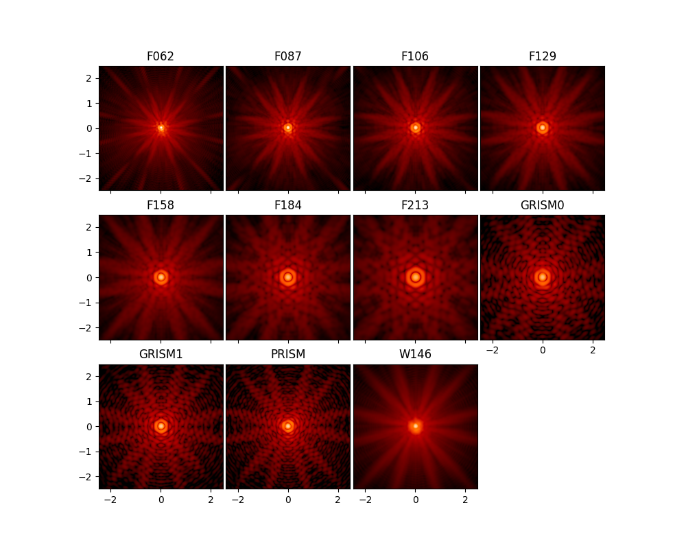
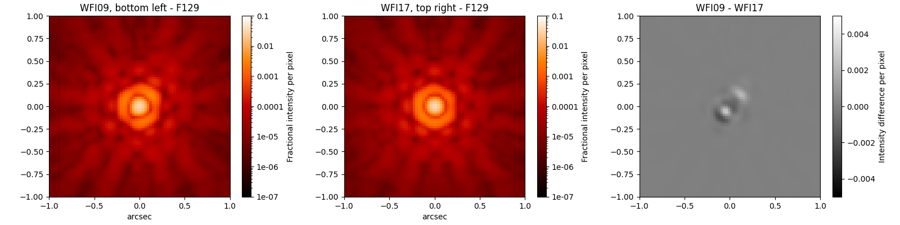
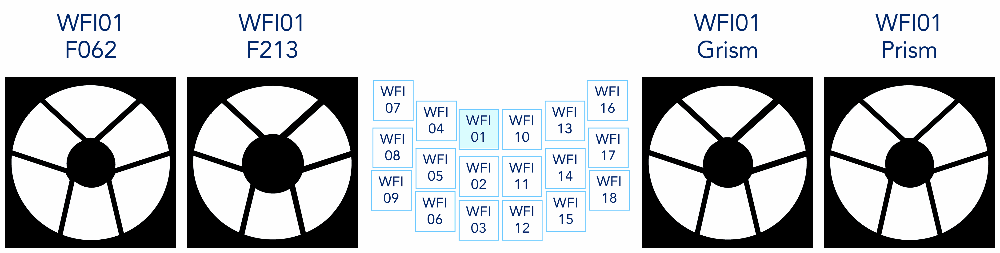

*******************************
Roman Instrument Model Details
*******************************

The :py:mod:`stpsf.roman`
module enables simulations of Roman's
:ref:`Wide Field Instrument (WFI) <roman_wfi>`.

.. _roman_wfi:

Wide Field Instrument (WFI)
===========================

   Sample PSFs for the filters in the Roman WFI on detector WFI01. Angular
   scale in arcseconds, log-scaled intensity. Note that the prism and
   grism PSFs shown here are monochromatic.

The WFI model is based on the Cycle 10 instrument reference information
from the Roman team at Goddard Space Flight Center (GSFC).
Though the pointing `jitter requirement for the Roman observatory <https://github.com/RomanSpaceTelescope/roman-technical-information/tree/main/data/Observatory/MissionandObservatoryTechnicalOverview#telescope-parameters>`_
is 0.008 arcsec per axis, STPSF's WFI model uses a lower value of 0.006 arcsec
per axis at GSFC's recommendation. More significantly, the WFI model also
incorporates charge diffusion as an additional Gaussian convolution kernel with
sigma 0.033 arcsec per axis.

.. note::

   The current (Cycle 10) Roman WFI optical model was calculated by Goddard
   Space Flight Center in September 2024.

To work with the WFI model, import and instantiate it like any of the JWST instruments::

    >>> from stpsf import roman
    >>> wfi = roman.WFI()

Usage of the WFI model class is, for the most part, just like any other STPSF
instrument model. For help setting attributes like filters, position offsets,
and sampling, refer to `Using STPSF <usage.html>`_.

The WFI model includes a model for field dependent PSF aberrations. With as
large a field of view as the WFI is designed to cover, there will be variation
in the PSF from one end of the field of view to the other. STPSF's WFI model
faithfully reproduces the field dependent aberrations calculated from the
Goddard Roman team's Cycle 9 WFI design. This provides a toolkit for users to
assess the impact of inter-detector and intra-detector PSF variations on
science cases of interest.

.. note::

   *Tutorial notebook for Roman*

   This documentation is complemented by an
   `IPython Notebook tutorial for Roman PSFs <https://github.com/spacetelescope/stpsf/blob/develop/notebooks/STPSF-Roman_Tutorial.ipynb>`_.
   Download the notebook to interactively explore code examples of common tasks
   and try a beta notebook GUI for the WFI model.

.. caution::

  As of STPSF 2.1, the pupil images from which the WFI model simulates PSFs
  include distortion effects. As such, **Roman WFI PSFs are distorted by
  default.** This distortion cannot be removed.

.. caution::

   Note that unlike most JWST modes, Roman WFI is *significantly* undersampled relative to Nyquist.
   Undersampled data is inherently lossy with information, and subject to aliasing. Measurements of
   properties such as encircled energy, FWHM, Strehl ratio, etc. cannot be done precisely on
   undersampled data.

   In flight, we will use dithering and similar strategies to reconstruct better-sampled images. The
   same can be done in simulation using STPSF. **Only measure PSF properties such as FWHM or
   encircled energy on well-sampled data**. That means either simulating dithered undersampled data
   at multiple subpixel steps and drizzling them back together, or else performing your measurements
   on oversampled calculation outputs. (I.e. in stpsf, set `wfi.oversample=4` or more, and perform
   your measurements on extension 0 of the returned FITS file.)

Field dependence in the WFI model
---------------------------------

Field points are specified in a STPSF calculation by selecting a detector and
pixel coordinates within that detector. A newly instantiated WFI model already
has a default detector and position. ::

   >>> wfi.detector
   'WFI01'
   >>> wfi.detector_position
   (2048, 2048)

.. figure:: ./roman_figures/field_layout.png
   :alt: The Wide Field Instrument's field of view, as projected on the sky.

   The Wide Field Instrument's field of view, as projected on the sky.

The WFI field of view is laid out as shown in the figure. To select a different detector, assign its name to the ``detector`` attribute::

   >>> wfi.detector_list
   ['WFI01', 'WFI02', 'WFI03', 'WFI04', 'WFI05', 'WFI06', 'WFI07', 'WFI08', 'WFI09', 'WFI10', 'WFI11', 'WFI12', 'WFI13', 'WFI14', 'WFI15', 'WFI16', 'WFI17', 'WFI18']
   >>> wfi.detector = 'WFI03'

The usable, photosensitive regions of the Wide Field Instrument's detectors are
slightly smaller than their 4096 by 4096 pixel dimensions because the outermost
four rows and columns are reference pixels that are not sensitive to light. To
change the position at which to calculate a PSF, assign an (X, Y) tuple::

   >>> wfi.detector_position = (4, 400)

The reference information available gives the field dependent aberrations in
terms of Zernike polynomial coefficients from :math:`Z_1` to :math:`Z_{45}`.
These coefficients were calculated for five field points on each of 18
detectors, providing coverage from 0.76 :math:`\mu m` to 2.3 :math:`\mu m`
(the WFI's entire wavelength range). STPSF interpolates the coefficients in
position and wavelength space to allow users to simulate PSFs at any valid
pixel position and wavelength. STPSF approximates the aberrations for an
out-of-range detector position by using the nearest field point.

Bear in mind that setting a pixel position does not automatically set the
**centering** of a calculated PSF. As with other models in STPSF, specify
'even' (centered on crosshairs between four pixels) or 'odd'
(centered on pixel center) parity through the ``options`` dictionary. ::

   >>> wfi.options['parity'] = 'even'  # best case for dividing PSF core flux
   >>> wfi.options['parity'] = 'odd'  # worst case for PSF core flux landing in a single pixel

Example: Computing the PSF difference between opposite corners of the WFI field of view
-----------------------------------------------------------------------------------------

This example shows the power of STPSF to simulate and analyze field dependent
variation in the WFI model. A dozen lines of code produce a figure showing how
the PSF differs between the two extreme edges of the instrument field of view.

::

   >>> wfi = roman.WFI()
   >>> wfi.filter = 'F129'
   >>> wfi.detector = 'WFI09'
   >>> wfi.detector_position = (4, 4)
   >>> psf_wfi09 = wfi.calc_psf()
   >>> wfi.detector = 'WFI17'
   >>> wfi.detector_position = (4092, 4092)
   >>> psf_wfi17 = wfi.calc_psf()
   >>> fig, (ax_wfi09, ax_wfi17, ax_diff) = plt.subplots(1, 3, figsize=(16, 4))
   >>> stpsf.display_psf(psf_wfi09, ax=ax_wfi09, imagecrop=2.0,
                         title='WFI09, bottom left - F129')
   >>> stpsf.display_psf(psf_wfi17, ax=ax_wfi17, imagecrop=2.0,
                         title='WFI17, top right - F129')
   >>> stpsf.display_psf_difference(psf_wfi09, psf_wfi17, ax=ax_diff,
                                    vmax=5e-3, title='WFI09 - WFI17', imagecrop=2.0)

   This figure shows oversampled PSFs in the F129 filter at two different field
   points, and the intensity difference image between the two.

Pupil variation and pupil masks in the WFI model
------------------------------------------------

As before, the Cycle 10 reference data release from the Goddard Space Flight
Center features field-dependent pupil images for the WFI. However, this cycle's
pupil images are categorized in a manner that diverges from that of previous cycles.

For the first time, each WFI imaging filter comes with its own set of
field-dependent aberrations and pupil images. This eliminates the need to group
filters into broader pupil masks as was done in previous releases. For example,
in STPSF version 2.0.0, the F184 and F213 filters shared the `'Wide'` pupil
mask. Both filters now have separate "F184" and "F213" pupil masks. The same is
true for the shorter wavelength imaging filters and the prism. (The prism mode
operates without obstruction, so it is only assigned a "pupil mask" in STPSF
for the sake of consistency with other optical elements.) The "GRISM0" and
"GRISM1" filters still share a "GRISM" pupil mask.

   Pupil masks at different field points.

The pupil and pupil mask are dynamically selected as needed whenever the detector or filter is changed. To override this behavior for either attribute, see `WFI.lock_pupil()` and `WFI.lock_pupil_mask()`.

.. _roman_coronagraph:

Coronagraph Instrument
======================

.. admonition:: Quickstart Jupyter Notebook

    Roman's :ref:`Coronagraph Instrument <roman_coronagraph>` is not modeled within
    STPSF. Users interested in CGI models should see the `corgisim <https://github.com/roman-corgi/corgisim>`_ package
    developed by the Roman Coronagraph's community team.

There was previously in STPSF an initial/prototype model of early versions of the Roman Coronagraph, but this
was deprecated and the code has been removed.

